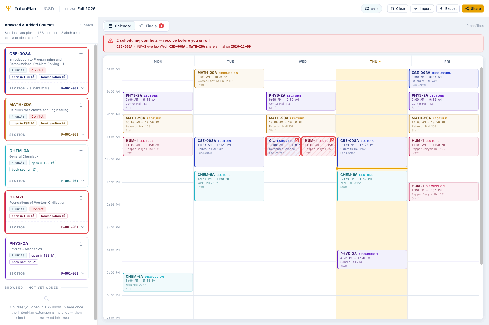
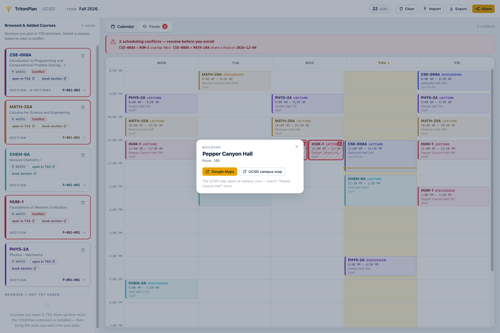

**English** | [中文](./README.zh-CN.md)

# TritonPlan

**A calendar-first course planner for UC San Diego — the WebReg "plan" view that the new Triton Student System (TSS) never shipped.**

**➡️ Open the planner: <https://hfjddjksaj.github.io/tritonplan/>**
**➡️ Install the extension: [Chrome Web Store](https://chromewebstore.google.com/detail/tritonplan/lnchlccmjhhpbbemlfnpldooeehcmjel)**

The old WebReg showed your week as a calendar — times, locations, professors, sections, final exams — and flagged time conflicts before you enrolled. TSS doesn't. TritonPlan rebuilds that view:

1. **A Chrome / Edge extension** that passively reads the course data TSS already displays to you and puts a **"+ TritonPlan"** button on each bookable section.
2. **A static planner website** that draws your week as a calendar and flags conflicts. No backend — nothing you do there leaves your browser.

> **Unofficial, student-made tool.** Not affiliated with, authorized, or endorsed by UC San Diego. See [Disclaimer](#disclaimer) and [PRIVACY.md](./PRIVACY.md).

---

## Features

- **Weekly calendar grid** — every lecture, discussion, and lab laid out by day and time, with a live "now" line on today.
- **Time-conflict detection** — overlapping meetings light up so clashes are visible at a glance.
- **Finals view** — your final exams in date order plus a finals-week calendar (weekends included), with its own overlap detection.
- **Section switching** — compare a course's lecture/discussion/lab combinations (tagged LEC / DIS / LAB, with seat counts) and switch right in the planner to clear a conflict.
- **Jump back to TSS** — click a course code on the calendar to return to that exact course in TSS, or jump straight to the section's booking page.
- **Building lookup** — click a class's location to see which building it is, with Google Maps and UCSD campus map links.
- **Share & export** — the whole plan compresses into a shareable URL; JSON export/import for backups.
- **Local-first** — plans live in your browser's `localStorage`. Nothing is uploaded.

## Screenshots

---

## How it works: capturing the OData the server already sends you

TSS is an SAP (SAPUI5 / Fiori) web app. When you browse the Schedule of Classes, the TSS server sends your browser the course data as **OData** (JSON) responses, and the page renders them on screen.

That's all TritonPlan needs. The extension **captures those responses as they arrive in your browser** — a copy of data the server already sent *you* — parses the schedules out of them, and hands the result to the planner page. It never asks the server for anything.

This passive design is the product's hard rule:

- **Zero requests of its own.** The extension only observes responses the TSS page itself fetched (`response.clone()` on the page's own `fetch`/`XHR`). It never issues, replays, retries, prefetches, or polls.
- **Zero automation.** It never clicks TSS buttons or submits anything on your behalf.
- **Indistinguishable traffic.** Because it adds nothing, your traffic is byte-for-byte identical to any other student's.
- **Minimal permissions.** `storage` and `tabs`, plus host access to `tss.ucsd.edu` and the planner site only. No analytics, no tracking.

---

## How to use

1. **[Install the extension](https://chromewebstore.google.com/detail/tritonplan/lnchlccmjhhpbbemlfnpldooeehcmjel)** (works in Edge too — it installs straight from the Chrome Web Store).
2. Browse the **Schedule of Classes** in TSS as usual.
3. Click **"+ TritonPlan"** on a section you want — you land on the planner with it placed.
4. Arrange sections to avoid conflicts, and check the **Finals** view.
5. **Share or export** your plan.

Manual install (load unpacked)

1. Build from source: `npm install && npm run build -w @triton/extension` → `extension/dist`.
2. Open `chrome://extensions`, enable **Developer mode**, click **Load unpacked**, select `extension/dist`.

**Platforms:** the extension runs on Chrome and Edge (MV3) on any OS; the planner site works in any modern browser.

---

## Privacy

No accounts, no backend, no data collection. Everything stays in your browser — see [PRIVACY.md](./PRIVACY.md).

## Developing

Monorepo: `shared/` (data model + conflict logic), `web/` (React planner), `extension/` (MV3). Setup, commands, and architecture: [docs/development.md](./docs/development.md).

## Credits

Built with the help of **Claude AI** — Anthropic's **Claude Code**.

## Disclaimer

TritonPlan is an **unofficial, student-made tool**, not affiliated with, authorized, or endorsed by UC San Diego. It only reads course data already displayed in your own browser and stores it locally on your device. Provided **as-is, with no warranty — use at your own risk**. You are responsible for using it in accordance with UCSD's Acceptable Use Policy and all applicable UCSD policies.

## License

MIT — see the `license` field in [`package.json`](./package.json).
