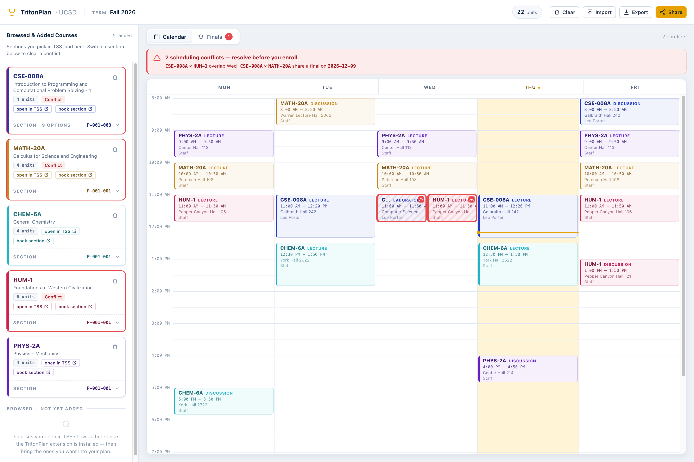
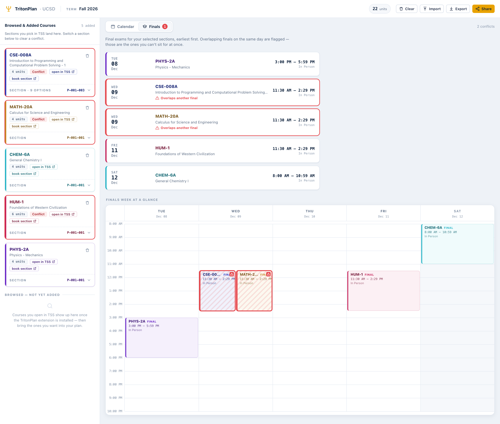
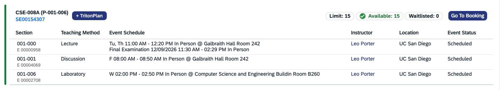

[English](./README.md) | **中文**

# TritonPlan（崔顿排课）

**一款以日历为核心的加州大学圣地亚哥分校（UCSD）排课工具 —— 找回新版 Triton Student System（TSS）从未提供的 WebReg "plan"（排课）视图。**

**➡️ 打开排课网站：<https://hfjddjksaj.github.io/tritonplan/>**

TritonPlan 找回了几乎每个 UCSD 学生都怀念的功能：像 Google 日历一样按周展示你的课程 —— 上课时间、地点、教授、Section，**以及期末考试时间** —— 并即时检测时间冲突。老 **WebReg** 有这个功能，新的 **Triton Student System（TSS）** 却没有。所以我们把它重做了一遍 —— 并配上一套全新的、以日历为核心的界面。

> **非官方、学生自制工具。** 与 UC San Diego 无隶属关系，未获其授权或认可。它只读取 TSS 本就在**你自己的**浏览器里展示给**你**的课程数据，并把一切都留在**你的**设备上。详见[免责声明](#免责声明)与 [PRIVACY.md](./PRIVACY.md)。

---

## 它是什么

TritonPlan 由两个协同工作的部分组成：

1. **一个 Chrome / Edge 浏览器扩展** —— 它**被动地**读取 TSS 本就展示给你的课程数据，并在每个可选的 Section 上注入一个小小的 **"+ TritonPlan"** 按钮。点一下，这门课就直接落到你的排课表上。
2. **排课网站**（上方链接）—— 它把你的一周画成日历，标出冲突，并让你分享或导出你的方案。它是一个完全静态的网站，**没有后端** —— 你在上面做的一切都不会离开你的浏览器。

你照常在 TSS 里浏览课程，TritonPlan 则在背后悄悄把它们变成一张你真正能拿来做决策的每周课表。

---

## 功能

- **每周日历网格** —— 每节 Lecture、Discussion、Lab 都按周一至周日、按时间段排布，今天所在列还有实时的"当前时间线"。
- **时间冲突检测与高亮** —— 核心价值。相互重叠的上课时段会亮起，让你一眼看清冲突。
- **期末考试（Finals）视图** —— 专门按日期顺序列出你的期末考试，并独立检测期末冲突（在选课前就发现连轴转或相互重叠的考试）。
- **切换 Section 组合来化解冲突** —— 直接在排课表里为某门课换一套 Lecture / Discussion / Lab 组合，冲突随之消失。
- **"已浏览与已添加课程"侧栏** —— 你在 TSS 打开过的课程会汇集到侧栏，支持筛选、一键添加，也可以随手移除不想要的课程。
- **通过网址分享 + JSON 导出/导入** —— 你的整个方案会被编码进一个可分享的链接（压缩进网址里，无需服务器），也能导出/导入为 JSON 文件 —— 可移植到任何浏览器或分享给同学。
- **跳回 TSS** —— 点击日历上任意一个课程块，即可在 TSS 中重新打开那门课。
- **本地优先** —— 你的方案保存在浏览器的 `localStorage` 和可分享的网址里，不会上传到任何地方。

---

## 截图

*截图待补 —— 见 [`docs/screenshots/`](./docs/screenshots/)。*

<!--  -->
<!--  -->
<!--  -->

---

## 如何使用

1. **安装扩展**（见下方[安装扩展](#安装扩展)）。
2. 照常在 TSS 里**浏览一门课**（Schedule of Classes）。
3. 在你想要的 Section 上点击 **"+ TritonPlan"**。
4. 你会来到 **TritonPlan 日历**，那个 Section 已经为你摆好。
5. **调整你的 Section** 以避开冲突 —— 如果两门课撞车，就换一门课的 Section 组合，并查看 **Finals** 视图。
6. 满意后**分享或导出**你的方案。

你也可以直接打开排课网站 —— 从扩展的弹窗，或直接访问[网站](https://hfjddjksaj.github.io/tritonplan/)。

---

## 工作原理：捕获服务器本来就发给你的 OData

TSS 是一个 SAP（SAPUI5 / Fiori）网页应用。当你浏览 Schedule of Classes 时，TSS 服务器会把课程数据以 **OData**（JSON）响应的形式发到你的浏览器，页面再把它渲染到屏幕上。

**TritonPlan 需要的仅此而已。** 扩展只是在这些 OData 响应**到达你浏览器时把它们捕获下来** —— 复制一份服务器本来就已经发给*你*的数据 —— 从中解析出课表，再交给排课网站。它从不向服务器索取任何东西。

### 零封禁、纯被动观察的设计

这是整个产品围绕的一条铁律：

- 扩展**从不与 TSS 服务器通信**。它只观察 TSS 页面自己抓取的响应（对页面自己的 `fetch`/`XHR` 做 `response.clone()`）—— **从不自己发起、重放、重试、预取或轮询**任何请求。
- 它**从不自动化操作** TSS —— 从不点击 TSS 的按钮、从不替你提交任何东西。"+ TritonPlan" 按钮只读取已经捕获到的数据，并把它交给*我们自己的*排课网站。
- 因为它产生**零额外服务器流量**，你的流量与其他任何学生逐字节完全一致。**服务器无法把 TritonPlan 用户与普通学生区分开来。**
- **最小权限：** 仅 `storage` 和 `tabs`，外加对 `tss.ucsd.edu`（读取你屏幕上已有的数据）和排课网站（把数据交给它）的主机访问权限。没有广泛的网络访问、没有分析统计、没有追踪。

排课网站同样"无聊"得很刻意：一个静态页面，在你的浏览器里计算冲突、把方案存进 `localStorage`；分享则把整个方案压缩进链接本身。**没有后端、没有账号、不上传任何东西。**

*想了解内部实现？见[开发者指南](./docs/development.md)。*

---

## 安装扩展

### 从 Chrome 应用商店安装（推荐）

**[在 Chrome 应用商店获取 TritonPlan](https://chromewebstore.google.com/detail/tritonplan/lnchlccmjhhpbbemlfnpldooeehcmjel)** —— 点击**添加至 Chrome** 即可。Microsoft Edge 同样适用（Edge 可以直接从 Chrome 应用商店安装）。

### 手动安装（加载已解压的扩展）

在 Chrome 或 Edge（Chromium）中：

1. 获取一份已构建的扩展 —— 下载发布的 zip 并解压，或从源码构建（`npm install && npm run build -w @triton/extension` → `extension/dist`）。
2. 打开 `chrome://extensions`（或 `edge://extensions`）。
3. 打开**开发者模式**。
4. 点击**加载已解压的扩展程序**，选择扩展文件夹（`manifest.json` 位于其根目录）。
5. 登录 TSS 并打开 Schedule of Classes —— **"+ TritonPlan"** 按钮会出现在各 Section 卡片上。

开发者：环境搭建、常用命令与架构说明见[开发者指南](./docs/development.md)。

---

## 浏览器与平台支持

- **扩展：** Chrome 与 Edge（Chromium），Manifest V3 —— 同一个包在 Windows、macOS、Linux 和 ChromeOS 上完全一致地运行。Firefox 与 Safari 是可能的后续目标，暂不在计划内。
- **排课网站：** 任意操作系统上的任意现代浏览器（它只是一个静态网站）。

---

## 隐私

TritonPlan **不**收集任何个人数据，**没有**后端。一切都留在你的浏览器里。请阅读完整的[隐私政策](./PRIVACY.md)。

---

## 致谢

在 **Claude AI** —— Anthropic 的 **Claude Code** —— 的协助下构建。

---

## 免责声明

TritonPlan 是一款**非官方、学生自制的工具**，与 **UC San Diego 无隶属关系，未获其授权或认可**。它只读取本就已经展示在你自己浏览器里的课程数据，并把它保存在你的设备本地；它**不**收集、**不**传输任何个人数据。它按**"原样"提供，不作任何担保 —— 使用风险自负**。你需自行负责按照 UCSD 的《可接受使用政策》（Acceptable Use Policy）及所有适用的 UCSD 政策来使用它。

## 许可证

MIT —— 见 [`package.json`](./package.json) 中的 `license` 字段。
